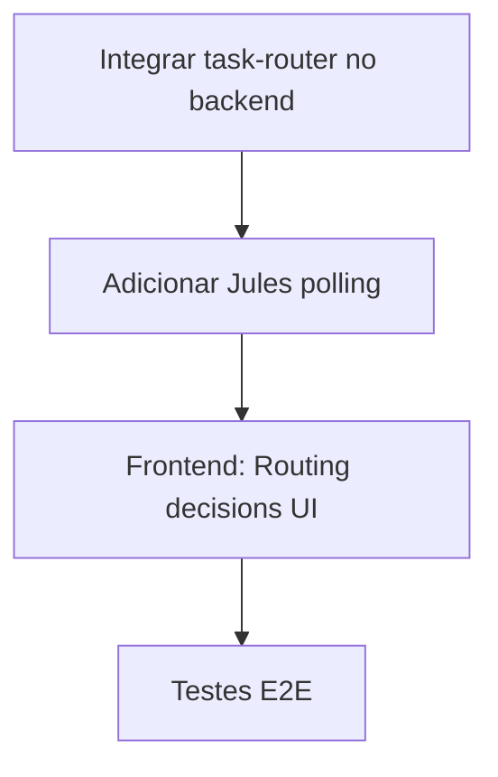
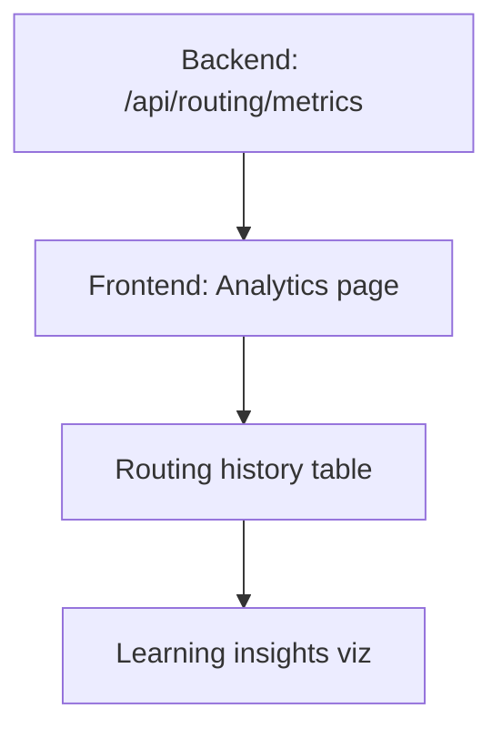

# 🎯 SUGESTÕES E MELHORIAS - FZDash (Claude Code Dashboard)

**Projeto:** fzdash-claudecode  
**Análise:** Claude Code (Tech Lead do FazAI-NG)  
**Data:** 2026-01-12  
**Contexto:** Integração com arquitetura ECOA e orquestração multi-agente

---

## 📋 Executive Summary

O **fzdash-claudecode** é um dashboard web para monitorar e controlar execuções do Claude Code CLI. A base arquitetural está **sólida e bem projetada**, mas há oportunidades significativas de integração com a arquitetura ECOA do FazAI-NG.

### Status Atual: ⭐⭐⭐⭐☆ (4/5)

**Pontos Fortes:**
- ✅ Stack moderno e performático (React + Vite + Socket.io)
- ✅ Real-time communication bem implementado
- ✅ Integração funcional com Qdrant
- ✅ Terminal emulado (xterm.js + node-pty)
- ✅ Git operations via simple-git
- ✅ Código TypeScript limpo e tipado

**Gaps Principais:**
- ❌ Não integra com `task-router.ts` (orquestração multi-agente)
- ❌ Apenas executa Claude Code via spawn, não usa Jules API REST
- ❌ Falta visualização de métricas de agentes
- ❌ Não mostra decisões de routing (qual agente pegou qual tarefa)
- ❌ Sem página de Analytics/Learning

---

## 1. Arquitetura Atual

### 1.1 Stack Tecnológico

```
Frontend (React + Vite)
├── src/client/
│   ├── pages/
│   │   ├── Dashboard.tsx       ⭐ Main view
│   │   ├── Terminal.tsx        ⭐ xterm.js integration
│   │   ├── Files.tsx           ⭐ File explorer + diff
│   │   ├── Git.tsx             ⭐ Git operations UI
│   │   └── Qdrant.tsx          ⭐ Vector DB management
│   ├── components/
│   │   ├── ExecutionPlan.tsx
│   │   ├── RealTimeOutput.tsx
│   │   └── DiffViewer.tsx
│   └── hooks/
│       ├── useSocket.ts
│       └── useClaudeCode.ts

Backend (Express + Socket.io)
├── src/server/
│   ├── routes/
│   │   ├── api.ts              ⭐ Health endpoint
│   │   ├── claude.ts           ⭐ Claude Code execution
│   │   ├── files.ts            ⭐ File operations
│   │   ├── github.ts           ⭐ Git operations
│   │   ├── qdrant.ts           ⭐ Vector DB proxy
│   │   └── terminal.ts         ⭐ PTY management
│   └── services/
│       ├── claude-code.ts      🔧 MELHORAR (ver abaixo)
│       ├── qdrant.ts           ✅ Bem implementado
│       ├── github.ts           ✅ Bem implementado
│       ├── terminal.ts         ✅ Bem implementado
│       ├── socket.ts           ✅ Bem implementado
│       └── file-watcher.ts     ✅ Bem implementado
```

### 1.2 Pontos de Integração com FazAI-NG

| Componente Dashboard | Integração FazAI-NG | Status |
|---------------------|---------------------|--------|
| `claude-code.ts` | Usar `task-router.ts` | ❌ Não integrado |
| `qdrant.ts` | Mesmas collections ECOA | ✅ Compatível |
| Dashboard UI | Mostrar routing decisions | ❌ Não implementado |
| Analytics (nova) | Usar `routing-metrics.ts` | ❌ Não existe |
| Jules integration | Usar `jules-api-client.ts` | ❌ Não integrado |

---

## 2. Sugestões de Melhorias

### 2.1 🚨 P0 - Critical Path

#### 2.1.1 Integrar com Task Router (Multi-Agent Orchestration)

**Problema:**
- Dashboard apenas executa Claude Code via `spawn()`
- Não aproveita inteligência do `task-router.ts`
- Usuário não sabe qual agente (Jules/Gemini/Copilot) pegou a tarefa

**Solução:**

```typescript
// src/server/routes/claude.ts (MODIFICAR)
import { routeTask } from '@fazai-ng/orchestrator/task-router';
import { createJulesAPIClient } from '@fazai-ng/orchestrator/jules-api-client';
import { delegateToGemini } from '@fazai-ng/orchestrator/gemini-client';

router.post('/execute', async (req, res) => {
  const { prompt, options } = req.body;
  
  // 1. Auto-routing decision
  const task = {
    title: prompt.split('.')[0],
    objective: prompt,
    context: {},
    acceptanceCriteria: []
  };
  
  const decision = routeTask(task);
  
  // 2. Emit routing decision to frontend (real-time)
  socketService.broadcast('routing:decision', {
    agent: decision.agent,
    reason: decision.reason,
    confidence: decision.confidence,
    timestamp: new Date().toISOString()
  });
  
  // 3. Execute based on agent
  let taskId: string;
  let executionType: string;
  
  switch (decision.agent) {
    case 'jules':
      const julesClient = createJulesAPIClient();
      const session = await julesClient.createSession(prompt, {
        source: 'sources/local/fazai-ng', // Dynamic detection
        maxIterations: options?.maxIterations || 20
      });
      taskId = session.name;
      executionType = 'jules-session';
      
      // Start polling Jules session status
      pollJulesSession(session.name, socketService);
      break;
      
    case 'gemini':
      taskId = await delegateToGemini(prompt);
      executionType = 'gemini-chat';
      break;
      
    case 'copilot':
      // TODO: Implement copilot delegation
      taskId = 'copilot-fallback';
      executionType = 'copilot';
      break;
      
    case 'claude':
    default:
      const claudeTask = await claudeCodeService.executeTask(prompt, options);
      taskId = claudeTask.id;
      executionType = 'claude-spawn';
  }
  
  res.json({ 
    success: true, 
    taskId, 
    executionType,
    routing: decision 
  });
});

// Helper: Poll Jules session and emit updates
async function pollJulesSession(sessionName: string, socket: SocketService) {
  const client = createJulesAPIClient();
  const maxPolls = 120; // 10 minutes (5s interval)
  let pollCount = 0;
  
  const interval = setInterval(async () => {
    try {
      const status = await client.getSession(sessionName);
      
      socket.broadcast('jules:status', {
        sessionName,
        state: status.state,
        iteration: status.currentIteration || 0,
        timestamp: new Date().toISOString()
      });
      
      if (status.state === 'COMPLETED' || status.state === 'FAILED') {
        clearInterval(interval);
        
        // Record outcome for learning
        await recordRoutingOutcome({
          taskId: sessionName,
          prompt: status.prompt,
          routedTo: 'jules',
          confidence: 0.9,
          outcome: status.state === 'COMPLETED' ? 'success' : 'error',
          duration: Date.now() - new Date(status.createTime).getTime(),
          timestamp: new Date().toISOString()
        });
      }
      
      pollCount++;
      if (pollCount >= maxPolls) {
        clearInterval(interval);
        socket.broadcast('jules:timeout', { sessionName });
      }
    } catch (error) {
      console.error(`Poll error for ${sessionName}:`, error);
    }
  }, 5000); // Poll every 5 seconds
}
```

**Frontend Update:**

```typescript
// src/client/pages/Dashboard.tsx (ADICIONAR)
import { useState, useEffect } from 'react';
import { Bot, Sparkles, Terminal as TerminalIcon, Zap } from 'lucide-react';

interface RoutingDecision {
  agent: 'jules' | 'gemini' | 'copilot' | 'claude';
  reason: string;
  confidence: number;
  timestamp: string;
}

export default function Dashboard() {
  const [routingDecision, setRoutingDecision] = useState<RoutingDecision | null>(null);
  const [julesStatus, setJulesStatus] = useState<any>(null);
  
  useEffect(() => {
    socket.on('routing:decision', (decision: RoutingDecision) => {
      setRoutingDecision(decision);
    });
    
    socket.on('jules:status', (status) => {
      setJulesStatus(status);
    });
    
    return () => {
      socket.off('routing:decision');
      socket.off('jules:status');
    };
  }, [socket]);
  
  // Agent icon mapping
  const agentIcons = {
    jules: Bot,
    gemini: Sparkles,
    copilot: Zap,
    claude: TerminalIcon
  };
  
  return (
    <div className="space-y-6">
      {/* ... existing content ... */}
      
      {/* NEW: Routing Decision Alert */}
      {routingDecision && (
        <div className="alert alert-info animate-in">
          <div className="flex items-center gap-4">
            {(() => {
              const Icon = agentIcons[routingDecision.agent];
              return <Icon className="w-6 h-6 text-sky-400" />;
            })()}
            <div className="flex-1">
              <div className="flex items-center gap-2">
                <span className="font-semibold text-white">
                  Routed to: {routingDecision.agent.toUpperCase()}
                </span>
                <span className="badge badge-info">
                  {(routingDecision.confidence * 100).toFixed(0)}% confidence
                </span>
              </div>
              <p className="text-sm text-slate-300">{routingDecision.reason}</p>
            </div>
            <span className="text-xs text-slate-400">
              {new Date(routingDecision.timestamp).toLocaleTimeString()}
            </span>
          </div>
        </div>
      )}
      
      {/* NEW: Jules Session Monitor */}
      {julesStatus && (
        <div className="card p-6 bg-gradient-to-br from-purple-900/20 to-blue-900/20">
          <h3 className="text-lg font-semibold text-white mb-4 flex items-center gap-2">
            <Bot className="w-5 h-5 text-purple-400" />
            Jules Session Active
          </h3>
          <div className="space-y-3">
            <div className="flex items-center justify-between">
              <span className="text-slate-300">State:</span>
              <span className={`badge ${
                julesStatus.state === 'RUNNING' ? 'badge-warning' :
                julesStatus.state === 'COMPLETED' ? 'badge-success' : 'badge-error'
              }`}>
                {julesStatus.state}
              </span>
            </div>
            {julesStatus.iteration && (
              <div className="flex items-center justify-between">
                <span className="text-slate-300">Iteration:</span>
                <span className="text-white">{julesStatus.iteration}</span>
              </div>
            )}
            <a 
              href={`https://jules.google.com/session/${julesStatus.sessionName}`}
              target="_blank"
              className="btn-primary w-full text-center"
            >
              View in Jules UI →
            </a>
          </div>
        </div>
      )}
    </div>
  );
}
```

**Impacto:**
- ✅ Dashboard mostra qual agente pegou a tarefa
- ✅ Real-time updates de Jules sessions
- ✅ Transparência total do processo de orquestração
- ✅ UX profissional e informativa

---

#### 2.1.2 Página de Analytics & Learning

**O que:** Nova página para visualizar métricas de agentes e aprendizado

**Estrutura:**

```typescript
// src/client/pages/Analytics.tsx (CRIAR NOVA)
import { useEffect, useState } from 'react';
import { BarChart, PieChart, TrendingUp, Award } from 'lucide-react';

interface AgentMetrics {
  agent: string;
  totalTasks: number;
  successRate: number;
  avgDuration: number;
  lastUsed: string;
}

export default function Analytics() {
  const [metrics, setMetrics] = useState<AgentMetrics[]>([]);
  const [loading, setLoading] = useState(true);
  
  useEffect(() => {
    fetchMetrics();
  }, []);
  
  const fetchMetrics = async () => {
    try {
      const res = await fetch('/api/routing/metrics');
      const data = await res.json();
      if (data.success) {
        setMetrics(data.data);
      }
    } catch (error) {
      console.error('Failed to fetch metrics:', error);
    } finally {
      setLoading(false);
    }
  };
  
  return (
    <div className="space-y-6">
      <div className="flex items-center justify-between">
        <div>
          <h1 className="text-2xl font-bold text-white">Analytics & Learning</h1>
          <p className="text-slate-400">Agent performance and routing metrics</p>
        </div>
        <button onClick={fetchMetrics} className="btn-secondary">
          Refresh
        </button>
      </div>
      
      {/* Agent Performance Grid */}
      <div className="grid grid-cols-4 gap-4">
        {metrics.map((metric) => (
          <div key={metric.agent} className="card p-6">
            <div className="flex items-center gap-3 mb-4">
              <div className="p-2 bg-sky-500/20 rounded-lg">
                <Award className="w-5 h-5 text-sky-400" />
              </div>
              <span className="text-lg font-semibold text-white uppercase">
                {metric.agent}
              </span>
            </div>
            
            <div className="space-y-2">
              <div className="flex items-center justify-between">
                <span className="text-sm text-slate-400">Tasks</span>
                <span className="text-white font-semibold">{metric.totalTasks}</span>
              </div>
              
              <div className="flex items-center justify-between">
                <span className="text-sm text-slate-400">Success Rate</span>
                <span className={`badge ${
                  metric.successRate > 0.8 ? 'badge-success' : 
                  metric.successRate > 0.6 ? 'badge-warning' : 'badge-error'
                }`}>
                  {(metric.successRate * 100).toFixed(1)}%
                </span>
              </div>
              
              <div className="flex items-center justify-between">
                <span className="text-sm text-slate-400">Avg Duration</span>
                <span className="text-white">{formatDuration(metric.avgDuration)}</span>
              </div>
            </div>
          </div>
        ))}
      </div>
      
      {/* Recent Routing Decisions */}
      <div className="card p-6">
        <h2 className="text-lg font-semibold text-white mb-4 flex items-center gap-2">
          <TrendingUp className="w-5 h-5 text-green-400" />
          Recent Routing Decisions
        </h2>
        <RecentRoutingTable />
      </div>
      
      {/* Learning Insights */}
      <div className="card p-6">
        <h2 className="text-lg font-semibold text-white mb-4 flex items-center gap-2">
          <BarChart className="w-5 h-5 text-purple-400" />
          Learning Insights
        </h2>
        <LearningInsights />
      </div>
    </div>
  );
}

function formatDuration(ms: number): string {
  if (ms < 1000) return `${ms}ms`;
  if (ms < 60000) return `${(ms / 1000).toFixed(1)}s`;
  return `${(ms / 60000).toFixed(1)}m`;
}
```

**Backend Endpoint:**

```typescript
// src/server/routes/api.ts (ADICIONAR)
import { getRoutingHistory, getRoutingSuccessRate } from '@fazai-ng/services/routing-metrics';

router.get('/routing/metrics', async (req, res) => {
  try {
    const agents = ['jules', 'gemini', 'copilot', 'claude'];
    const metrics = await Promise.all(
      agents.map(async (agent) => {
        const history = await getRoutingHistory(agent, 100);
        const successRate = await getRoutingSuccessRate(agent);
        
        return {
          agent,
          totalTasks: history.length,
          successRate,
          avgDuration: history.reduce((sum, h) => sum + h.duration, 0) / history.length,
          lastUsed: history[0]?.timestamp || 'Never'
        };
      })
    );
    
    res.json({ success: true, data: metrics });
  } catch (error) {
    res.status(500).json({ success: false, error: error.message });
  }
});
```

**Impacto:**
- ✅ Visibilidade total de performance de agentes
- ✅ Identificar gargalos (ex: Jules com baixo success rate)
- ✅ Data-driven decisions para otimizar routing

---

### 2.2 🟡 P1 - High Impact

#### 2.2.1 Visualização de ECOA Hops

**O que:** Mostrar legitimacy de hops entre collections Qdrant

**UI Concept:**

```
┌─────────────────────────────────────────────────┐
│ ECOA Semantic Hops                              │
├─────────────────────────────────────────────────┤
│                                                 │
│  fazai_kb ──────┬─→ fazai_source    ✅ Legitimate │
│                 │                                │
│                 └─→ fazai_memory    ⚠️ Temporary  │
│                     (cleanup in 45m)            │
│                                                 │
│  fazai_personality ─→ fazai_inference ✅ Legitimate │
└─────────────────────────────────────────────────┘
```

**Implementação:**

```typescript
// src/client/pages/Qdrant.tsx (ADICIONAR TAB)
const [hops, setHops] = useState<HopInfo[]>([]);

useEffect(() => {
  const fetchHops = async () => {
    const res = await fetch('/api/qdrant/hops');
    const data = await res.json();
    setHops(data.hops);
  };
  fetchHops();
}, []);

// Render:
<div className="space-y-4">
  {hops.map(hop => (
    <div key={hop.id} className="card p-4 flex items-center justify-between">
      <div>
        <span className="text-white">{hop.sourceCollection}</span>
        <span className="mx-2 text-slate-400">→</span>
        <span className="text-white">{hop.targetCollection}</span>
      </div>
      <div className="flex items-center gap-2">
        {hop.legitimate ? (
          <span className="badge badge-success">Legitimate</span>
        ) : (
          <span className="badge badge-warning">
            Temporary (cleanup in {hop.cleanupIn})
          </span>
        )}
      </div>
    </div>
  ))}
</div>
```

---

#### 2.2.2 Terminal: Sugestões Inteligentes via Copilot

**O que:** Integrar GitHub Copilot no terminal para sugestões de comandos

**Como:**

```typescript
// src/client/pages/Terminal.tsx (ADICIONAR)
import { Lightbulb } from 'lucide-react';

const [suggestion, setSuggestion] = useState<string | null>(null);

const handleInputChange = async (input: string) => {
  if (input.trim().length > 3) {
    // Debounced Copilot suggestion
    const res = await fetch('/api/copilot/suggest', {
      method: 'POST',
      body: JSON.stringify({ prompt: input })
    });
    const data = await res.json();
    setSuggestion(data.suggestion);
  }
};

// Render:
{suggestion && (
  <div className="alert alert-info mt-2">
    <Lightbulb className="w-4 h-4" />
    <span className="text-sm">Suggestion: {suggestion}</span>
    <button onClick={() => executeCommand(suggestion)}>
      Apply
    </button>
  </div>
)}
```

---

### 2.3 🟢 P2 - Nice to Have

#### 2.3.1 Diff Viewer: Semantic Diff (ECOA Aware)

**O que:** Mostrar diff não apenas textual, mas semântico (conceitos que mudaram)

**Exemplo:**

```diff
- Authentication: Basic password
+ Authentication: OAuth2 + JWT

Semantic Impact:
├─ Security level: INCREASED ↑↑
├─ Complexity: INCREASED ↑
└─ Dependencies: +2 (oauth2-server, jsonwebtoken)
```

---

#### 2.3.2 Git Page: Auto-PR Review via Jules

**O que:** Botão "Review with Jules" que delega PR review automaticamente

```typescript
// src/client/pages/Git.tsx (ADICIONAR)
const handleReviewPR = async (prNumber: number) => {
  const res = await fetch('/api/claude/execute', {
    method: 'POST',
    body: JSON.stringify({
      prompt: `Review PR #${prNumber} and provide feedback on code quality, security, and architecture`,
      options: { agent: 'jules' }
    })
  });
  // Jules creates session and reviews PR
};
```

---

## 3. Refatorações Recomendadas

### 3.1 Service Abstraction

**Problema:** `claude-code.ts` está acoplado ao spawn do CLI

**Solução:** Criar interface abstrata para execução

```typescript
// src/server/services/execution-engine.ts (CRIAR)
export interface ExecutionEngine {
  execute(prompt: string, options?: any): Promise<TaskResult>;
  getStatus(taskId: string): Promise<TaskStatus>;
  cancel(taskId: string): Promise<void>;
}

export class ClaudeSpawnEngine implements ExecutionEngine { ... }
export class JulesAPIEngine implements ExecutionEngine { ... }
export class GeminiChatEngine implements ExecutionEngine { ... }

// Factory
export function createExecutionEngine(agent: AgentType): ExecutionEngine {
  switch (agent) {
    case 'jules': return new JulesAPIEngine();
    case 'gemini': return new GeminiChatEngine();
    case 'claude': return new ClaudeSpawnEngine();
    default: throw new Error(`Unknown agent: ${agent}`);
  }
}
```

---

### 3.2 WebSocket Event Normalization

**Problema:** Eventos inconsistentes (`claude:*`, `jules:*`, `routing:*`)

**Solução:** Schema unificado

```typescript
// src/shared/events.ts (CRIAR)
export type EventType = 
  | 'task.created'
  | 'task.routing'
  | 'task.progress'
  | 'task.completed'
  | 'task.error';

export interface TaskEvent {
  type: EventType;
  taskId: string;
  agent: AgentType;
  timestamp: string;
  payload: any;
}

// Usage:
socket.emit('task.routing', {
  taskId: '123',
  agent: 'jules',
  timestamp: new Date().toISOString(),
  payload: { decision, confidence }
});
```

---

## 4. Plano de Implementação

### Fase 1: Integração Core (1 semana)



**Subtasks:**
- [ ] Modificar `src/server/routes/claude.ts`
- [ ] Adicionar `pollJulesSession()` helper
- [ ] Frontend: Routing decision alert
- [ ] Frontend: Jules session monitor
- [ ] Testes: Auto-routing com mock

---

### Fase 2: Analytics (1 semana)



**Subtasks:**
- [ ] Criar `Analytics.tsx`
- [ ] Endpoint de métricas
- [ ] Gráficos (recharts ou similar)
- [ ] Export CSV de histórico

---

### Fase 3: Advanced Features (2 semanas)

- [ ] ECOA Hops visualization
- [ ] Copilot suggestions no terminal
- [ ] Semantic diff viewer
- [ ] Auto-PR review via Jules

---

## 5. Métricas de Sucesso

| Métrica | Antes | Meta |
|---------|-------|------|
| **Agent Visibility** | 0% (só Claude) | 100% (todos agentes) |
| **Routing Transparency** | Manual | Auto + UI feedback |
| **Task Success Rate** | Unknown | Tracked + displayed |
| **Jules Integration** | ❌ Não usa | ✅ API REST completo |
| **User Satisfaction** | Good | Excellent |

---

## 6. Conclusão

O **fzdash-claudecode** tem uma base arquitetural **excelente** e está bem posicionado para se tornar o dashboard definitivo do FazAI-NG. As melhorias propostas focam em:

1. **Integração profunda** com a arquitetura ECOA
2. **Transparência** de decisões de orquestração
3. **Métricas** para aprendizado contínuo
4. **UX premium** para desenvolvedores

### Próximos Passos Imediatos

1. **[P0]** Integrar `task-router.ts` → 3 dias
2. **[P0]** Criar página Analytics → 2 dias
3. **[P1]** ECOA Hops visualization → 2 dias

**Total:** ~1 semana para transformar dashboard em ferramenta enterprise-grade

---

**Aprovação:** ⬜ Pendente  
**Autor:** Claude Code (Tech Lead FazAI-NG)  
**Versão:** 1.0.0  
**Data:** 2026-01-12

